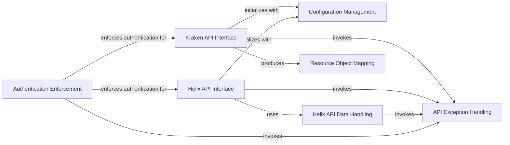

## Component Details

This subsystem manages the loading and application of API configurations, handles various API-specific exceptions, and enforces authentication requirements for secure operations. It provides the foundational utilities for both Kraken and Helix API interfaces to function correctly and robustly.

### Configuration Management
This component is responsible for loading and managing API credentials and settings, such as client IDs, client secrets, and backoff configurations, from various sources, primarily configuration files. It ensures that API clients are properly initialized with the necessary settings.

**Related Classes/Methods**:

- <a href="https://github.com/tsifrer/python-twitch-client/blob/master/twitch/conf.py#L13-L22" target="_blank" rel="noopener noreferrer">`twitch.conf.credentials_from_config_file` (13:22)</a>
- <a href="https://github.com/tsifrer/python-twitch-client/blob/master/twitch/conf.py#L25-L34" target="_blank" rel="noopener noreferrer">`twitch.conf.backoff_config` (25:34)</a>
- <a href="https://github.com/tsifrer/python-twitch-client/blob/master/twitch/conf.py#L7-L10" target="_blank" rel="noopener noreferrer">`twitch.conf._get_config` (7:10)</a>

### API Exception Handling
This component defines a hierarchy of custom exceptions specific to the Twitch API client. It provides specialized exception types for various error scenarios, including authentication failures, missing attributes, and general API-related issues, allowing for robust error management throughout the application.

**Related Classes/Methods**:

- <a href="https://github.com/tsifrer/python-twitch-client/blob/master/twitch/exceptions.py#L1-L2" target="_blank" rel="noopener noreferrer">`twitch.exceptions.TwitchException` (1:2)</a>
- <a href="https://github.com/tsifrer/python-twitch-client/blob/master/twitch/exceptions.py#L5-L6" target="_blank" rel="noopener noreferrer">`twitch.exceptions.TwitchAuthException` (5:6)</a>
- <a href="https://github.com/tsifrer/python-twitch-client/blob/master/twitch/exceptions.py#L9-L10" target="_blank" rel="noopener noreferrer">`twitch.exceptions.TwitchAttributeException` (9:10)</a>
- <a href="https://github.com/tsifrer/python-twitch-client/blob/master/twitch/exceptions.py#L13-L14" target="_blank" rel="noopener noreferrer">`twitch.exceptions.TwitchNotProvidedException` (13:14)</a>
- <a href="https://github.com/tsifrer/python-twitch-client/blob/master/twitch/exceptions.py#L17-L18" target="_blank" rel="noopener noreferrer">`twitch.exceptions.TwitchOAuthException` (17:18)</a>

### Authentication Enforcement
This component provides decorators to enforce authentication requirements for sensitive API operations. It ensures that methods requiring OAuth tokens or specific authentication are only executed when the necessary credentials are provided, raising appropriate exceptions otherwise.

**Related Classes/Methods**:

- <a href="https://github.com/tsifrer/python-twitch-client/blob/master/twitch/decorators.py#L4-L10" target="_blank" rel="noopener noreferrer">`twitch.decorators.oauth_required` (4:10)</a>

### Kraken API Interface
Serves as the primary interface for interacting with the Twitch API v5 (Kraken), encapsulating various API categories like streams, users, and communities, and handling the underlying HTTP requests.

**Related Classes/Methods**:

- <a href="https://github.com/tsifrer/python-twitch-client/blob/master/twitch/client.py#L24-L43" target="_blank" rel="noopener noreferrer">`twitch.client.TwitchClient.__init__` (24:43)</a>
- <a href="https://github.com/tsifrer/python-twitch-client/blob/master/twitch/api/base.py#L15-L20" target="_blank" rel="noopener noreferrer">`twitch.api.base.TwitchAPI.__init__` (15:20)</a>
- <a href="https://github.com/tsifrer/python-twitch-client/blob/master/twitch/api/base.py#L34-L57" target="_blank" rel="noopener noreferrer">`twitch.api.base.TwitchAPI._request_get` (34:57)</a>
- <a href="https://github.com/tsifrer/python-twitch-client/blob/master/twitch/api/collections.py#L19-L31" target="_blank" rel="noopener noreferrer">`twitch.api.collections.Collections.get_by_channel` (19:31)</a>
- <a href="https://github.com/tsifrer/python-twitch-client/blob/master/twitch/api/streams.py#L9-L22" target="_blank" rel="noopener noreferrer">`twitch.api.streams.Streams.get_stream_by_user` (9:22)</a>
- <a href="https://github.com/tsifrer/python-twitch-client/blob/master/twitch/api/users.py#L36-L57" target="_blank" rel="noopener noreferrer">`twitch.api.users.Users.get_all_follows` (36:57)</a>

### Helix API Interface
Provides the interface for accessing the Twitch Helix API, offering methods to retrieve modern Twitch data such as streams, games, and user information with advanced filtering.

**Related Classes/Methods**:

- <a href="https://github.com/tsifrer/python-twitch-client/blob/master/twitch/helix/api.py#L32-L41" target="_blank" rel="noopener noreferrer">`twitch.helix.api.TwitchHelix.__init__` (32:41)</a>
- <a href="https://github.com/tsifrer/python-twitch-client/blob/master/twitch/helix/api.py#L43-L70" target="_blank" rel="noopener noreferrer">`twitch.helix.api.TwitchHelix.get_oauth` (43:70)</a>
- <a href="https://github.com/tsifrer/python-twitch-client/blob/master/twitch/helix/api.py#L72-L118" target="_blank" rel="noopener noreferrer">`twitch.helix.api.TwitchHelix.get_streams` (72:118)</a>
- <a href="https://github.com/tsifrer/python-twitch-client/blob/master/twitch/helix/api.py#L120-L136" target="_blank" rel="noopener noreferrer">`twitch.helix.api.TwitchHelix.get_games` (120:136)</a>
- <a href="https://github.com/tsifrer/python-twitch-client/blob/master/twitch/helix/api.py#L138-L187" target="_blank" rel="noopener noreferrer">`twitch.helix.api.TwitchHelix.get_clips` (138:187)</a>
- <a href="https://github.com/tsifrer/python-twitch-client/blob/master/twitch/helix/api.py#L189-L205" target="_blank" rel="noopener noreferrer">`twitch.helix.api.TwitchHelix.get_top_games` (189:205)</a>
- <a href="https://github.com/tsifrer/python-twitch-client/blob/master/twitch/helix/api.py#L207-L271" target="_blank" rel="noopener noreferrer">`twitch.helix.api.TwitchHelix.get_videos` (207:271)</a>
- <a href="https://github.com/tsifrer/python-twitch-client/blob/master/twitch/helix/api.py#L273-L319" target="_blank" rel="noopener noreferrer">`twitch.helix.api.TwitchHelix.get_streams_metadata` (273:319)</a>
- <a href="https://github.com/tsifrer/python-twitch-client/blob/master/twitch/helix/api.py#L321-L340" target="_blank" rel="noopener noreferrer">`twitch.helix.api.TwitchHelix.get_user_follows` (321:340)</a>
- <a href="https://github.com/tsifrer/python-twitch-client/blob/master/twitch/helix/api.py#L342-L358" target="_blank" rel="noopener noreferrer">`twitch.helix.api.TwitchHelix.get_users` (342:358)</a>
- <a href="https://github.com/tsifrer/python-twitch-client/blob/master/twitch/helix/api.py#L360-L376" target="_blank" rel="noopener noreferrer">`twitch.helix.api.TwitchHelix.get_tags` (360:376)</a>

### Helix API Data Handling
Manages the specifics of data retrieval and pagination for the Helix API, including cursor-based navigation and general data fetching mechanisms.

**Related Classes/Methods**:

- <a href="https://github.com/tsifrer/python-twitch-client/blob/master/twitch/helix/base.py#L140-L143" target="_blank" rel="noopener noreferrer">`twitch.helix.base.APICursor.total` (140:143)</a>
- <a href="https://github.com/tsifrer/python-twitch-client/blob/master/twitch/helix/base.py#L79-L143" target="_blank" rel="noopener noreferrer">`twitch.helix.base.APICursor` (79:143)</a>
- <a href="https://github.com/tsifrer/python-twitch-client/blob/master/twitch/helix/base.py#L155-L157" target="_blank" rel="noopener noreferrer">`twitch.helix.base.APIGet.fetch` (155:157)</a>
- <a href="https://github.com/tsifrer/python-twitch-client/blob/master/twitch/helix/base.py#L146-L157" target="_blank" rel="noopener noreferrer">`twitch.helix.base.APIGet` (146:157)</a>

### Resource Object Mapping
Converts raw JSON responses from the Twitch API into structured Python objects, providing an easy-to-use representation of Twitch resources for consumption by other components.

**Related Classes/Methods**:

- <a href="https://github.com/tsifrer/python-twitch-client/blob/master/twitch/resources.py#L58-L61" target="_blank" rel="noopener noreferrer">`twitch.resources.TwitchObject.construct_from` (58:61)</a>

### [FAQ](https://github.com/CodeBoarding/GeneratedOnBoardings/tree/main?tab=readme-ov-file#faq)