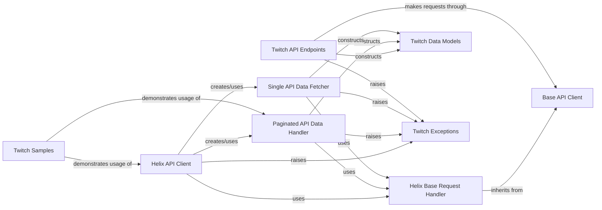

## Component Details

The API Request Handling subsystem is responsible for managing all HTTP communication with the Twitch API, encompassing both v5 and Helix endpoints. Its core purpose is to abstract the complexities of web requests, including setting appropriate headers, adhering to rate limits, and handling data pagination for efficient and compliant data retrieval. This subsystem ensures that the application can reliably interact with Twitch services to fetch various types of data.

### Base API Client
This component provides the fundamental HTTP request methods (GET, POST, PUT, DELETE) for interacting with the Twitch API (v5). It handles common functionalities like setting request headers, managing client ID and OAuth tokens, and implementing a basic backoff mechanism for server errors.

**Related Classes/Methods**:

- <a href="https://github.com/tsifrer/python-twitch-client/blob/master/twitch/api/base.py#L12-L95" target="_blank" rel="noopener noreferrer">`twitch.api.base.TwitchAPI` (12:95)</a>
- <a href="https://github.com/tsifrer/python-twitch-client/blob/master/twitch/api/base.py#L15-L20" target="_blank" rel="noopener noreferrer">`twitch.api.base.TwitchAPI:__init__` (15:20)</a>
- <a href="https://github.com/tsifrer/python-twitch-client/blob/master/twitch/api/base.py#L22-L32" target="_blank" rel="noopener noreferrer">`twitch.api.base.TwitchAPI:_get_request_headers` (22:32)</a>
- <a href="https://github.com/tsifrer/python-twitch-client/blob/master/twitch/api/base.py#L34-L57" target="_blank" rel="noopener noreferrer">`twitch.api.base.TwitchAPI:_request_get` (34:57)</a>
- <a href="https://github.com/tsifrer/python-twitch-client/blob/master/twitch/api/base.py#L59-L70" target="_blank" rel="noopener noreferrer">`twitch.api.base.TwitchAPI:_request_post` (59:70)</a>
- <a href="https://github.com/tsifrer/python-twitch-client/blob/master/twitch/api/base.py#L72-L82" target="_blank" rel="noopener noreferrer">`twitch.api.base.TwitchAPI:_request_put` (72:82)</a>
- <a href="https://github.com/tsifrer/python-twitch-client/blob/master/twitch/api/base.py#L84-L95" target="_blank" rel="noopener noreferrer">`twitch.api.base.TwitchAPI:_request_delete` (84:95)</a>

### Helix Base Request Handler
This mixin provides common request handling functionalities specifically for the Twitch Helix API. It includes methods for preparing request headers and managing Twitch's rate limits to ensure compliant and efficient API calls. It extends the basic request handling from Base API Client.

**Related Classes/Methods**:

- <a href="https://github.com/tsifrer/python-twitch-client/blob/master/twitch/helix/base.py#L14-L76" target="_blank" rel="noopener noreferrer">`twitch.helix.base.TwitchAPIMixin` (14:76)</a>
- <a href="https://github.com/tsifrer/python-twitch-client/blob/master/twitch/helix/base.py#L18-L38" target="_blank" rel="noopener noreferrer">`twitch.helix.base.TwitchAPIMixin:_wait_for_rate_limit_reset` (18:38)</a>
- <a href="https://github.com/tsifrer/python-twitch-client/blob/master/twitch/helix/base.py#L40-L46" target="_blank" rel="noopener noreferrer">`twitch.helix.base.TwitchAPIMixin:_get_request_headers` (40:46)</a>
- <a href="https://github.com/tsifrer/python-twitch-client/blob/master/twitch/helix/base.py#L48-L76" target="_blank" rel="noopener noreferrer">`twitch.helix.base.TwitchAPIMixin:_request_get` (48:76)</a>

### Paginated API Data Handler
This component is responsible for handling paginated responses from the Twitch Helix API. It allows for efficient retrieval of large datasets by managing cursors and fetching subsequent pages as needed, providing an iterable interface for results.

**Related Classes/Methods**:

- <a href="https://github.com/tsifrer/python-twitch-client/blob/master/twitch/helix/base.py#L79-L143" target="_blank" rel="noopener noreferrer">`twitch.helix.base.APICursor` (79:143)</a>
- <a href="https://github.com/tsifrer/python-twitch-client/blob/master/twitch/helix/base.py#L80-L95" target="_blank" rel="noopener noreferrer">`twitch.helix.base.APICursor:__init__` (80:95)</a>
- <a href="https://github.com/tsifrer/python-twitch-client/blob/master/twitch/helix/base.py#L118-L133" target="_blank" rel="noopener noreferrer">`twitch.helix.base.APICursor:next_page` (118:133)</a>
- <a href="https://github.com/tsifrer/python-twitch-client/blob/master/twitch/helix/base.py#L140-L143" target="_blank" rel="noopener noreferrer">`twitch.helix.base.APICursor:total` (140:143)</a>

### Single API Data Fetcher
This component is designed for fetching single-page data from the Twitch Helix API. It provides a straightforward method to retrieve non-paginated API responses and process them into structured data models.

**Related Classes/Methods**:

- <a href="https://github.com/tsifrer/python-twitch-client/blob/master/twitch/helix/base.py#L146-L157" target="_blank" rel="noopener noreferrer">`twitch.helix.base.APIGet` (146:157)</a>
- <a href="https://github.com/tsifrer/python-twitch-client/blob/master/twitch/helix/base.py#L155-L157" target="_blank" rel="noopener noreferrer">`twitch.helix.base.APIGet:fetch` (155:157)</a>

### Helix API Client
This component serves as the primary interface for interacting with the Twitch Helix API. It encapsulates various high-level methods for fetching data related to streams, games, clips, videos, and users, leveraging the underlying API request handlers.

**Related Classes/Methods**:

- <a href="https://github.com/tsifrer/python-twitch-client/blob/master/twitch/helix/api.py#L27-L376" target="_blank" rel="noopener noreferrer">`twitch.helix.api.TwitchHelix` (27:376)</a>
- <a href="https://github.com/tsifrer/python-twitch-client/blob/master/twitch/helix/api.py#L120-L136" target="_blank" rel="noopener noreferrer">`twitch.helix.api.TwitchHelix:get_games` (120:136)</a>
- <a href="https://github.com/tsifrer/python-twitch-client/blob/master/twitch/helix/api.py#L138-L187" target="_blank" rel="noopener noreferrer">`twitch.helix.api.TwitchHelix:get_clips` (138:187)</a>
- <a href="https://github.com/tsifrer/python-twitch-client/blob/master/twitch/helix/api.py#L207-L271" target="_blank" rel="noopener noreferrer">`twitch.helix.api.TwitchHelix:get_videos` (207:271)</a>
- <a href="https://github.com/tsifrer/python-twitch-client/blob/master/twitch/helix/api.py#L342-L358" target="_blank" rel="noopener noreferrer">`twitch.helix.api.TwitchHelix:get_users` (342:358)</a>
- <a href="https://github.com/tsifrer/python-twitch-client/blob/master/twitch/helix/api.py#L72-L118" target="_blank" rel="noopener noreferrer">`twitch.helix.api.TwitchHelix:get_streams` (72:118)</a>
- <a href="https://github.com/tsifrer/python-twitch-client/blob/master/twitch/helix/api.py#L189-L205" target="_blank" rel="noopener noreferrer">`twitch.helix.api.TwitchHelix:get_top_games` (189:205)</a>
- <a href="https://github.com/tsifrer/python-twitch-client/blob/master/twitch/helix/api.py#L273-L319" target="_blank" rel="noopener noreferrer">`twitch.helix.api.TwitchHelix:get_streams_metadata` (273:319)</a>
- <a href="https://github.com/tsifrer/python-twitch-client/blob/master/twitch/helix/api.py#L321-L340" target="_blank" rel="noopener noreferrer">`twitch.helix.api.TwitchHelix:get_user_follows` (321:340)</a>
- <a href="https://github.com/tsifrer/python-twitch-client/blob/master/twitch/helix/api.py#L360-L376" target="_blank" rel="noopener noreferrer">`twitch.helix.api.TwitchHelix:get_tags` (360:376)</a>
- <a href="https://github.com/tsifrer/python-twitch-client/blob/master/twitch/helix/api.py#L43-L70" target="_blank" rel="noopener noreferrer">`twitch.helix.api.TwitchHelix:get_oauth` (43:70)</a>

### Twitch API Endpoints
This group of components represents various specific functionalities and categories within the Twitch API (e.g., Collections, Streams, Users). Each component provides methods tailored to its domain, utilizing the Base API Client for underlying HTTP communication and Twitch Data Models for response parsing.

**Related Classes/Methods**:

- <a href="https://github.com/tsifrer/python-twitch-client/blob/master/twitch/api/collections.py#L7-L78" target="_blank" rel="noopener noreferrer">`twitch.api.collections.Collections` (7:78)</a>
- <a href="https://github.com/tsifrer/python-twitch-client/blob/master/twitch/api/streams.py#L8-L83" target="_blank" rel="noopener noreferrer">`twitch.api.streams.Streams` (8:83)</a>
- <a href="https://github.com/tsifrer/python-twitch-client/blob/master/twitch/api/users.py#L14-L130" target="_blank" rel="noopener noreferrer">`twitch.api.users.Users` (14:130)</a>
- <a href="https://github.com/tsifrer/python-twitch-client/blob/master/twitch/api/chat.py#L4-L18" target="_blank" rel="noopener noreferrer">`twitch.api.chat.Chat` (4:18)</a>
- <a href="https://github.com/tsifrer/python-twitch-client/blob/master/twitch/api/communities.py#L7-L136" target="_blank" rel="noopener noreferrer">`twitch.api.communities.Communities` (7:136)</a>
- <a href="https://github.com/tsifrer/python-twitch-client/blob/master/twitch/api/channel_feed.py#L7-L105" target="_blank" rel="noopener noreferrer">`twitch.api.channel_feed.ChannelFeed` (7:105)</a>
- <a href="https://github.com/tsifrer/python-twitch-client/blob/master/twitch/api/teams.py#L6-L19" target="_blank" rel="noopener noreferrer">`twitch.api.teams.Teams` (6:19)</a>
- <a href="https://github.com/tsifrer/python-twitch-client/blob/master/twitch/api/videos.py#L14-L88" target="_blank" rel="noopener noreferrer">`twitch.api.videos.Videos` (14:88)</a>
- <a href="https://github.com/tsifrer/python-twitch-client/blob/master/twitch/api/games.py#L6-L15" target="_blank" rel="noopener noreferrer">`twitch.api.games.Games` (6:15)</a>
- <a href="https://github.com/tsifrer/python-twitch-client/blob/master/twitch/api/channels.py#L16-L156" target="_blank" rel="noopener noreferrer">`twitch.api.channels.Channels` (16:156)</a>
- <a href="https://github.com/tsifrer/python-twitch-client/blob/master/twitch/api/clips.py#L8-L56" target="_blank" rel="noopener noreferrer">`twitch.api.clips.Clips` (8:56)</a>
- <a href="https://github.com/tsifrer/python-twitch-client/blob/master/twitch/api/ingests.py#L5-L8" target="_blank" rel="noopener noreferrer">`twitch.api.ingests.Ingests` (5:8)</a>
- <a href="https://github.com/tsifrer/python-twitch-client/blob/master/twitch/api/search.py#L6-L33" target="_blank" rel="noopener noreferrer">`twitch.api.search.Search` (6:33)</a>

### Twitch Data Models
This component defines the structure and methods for converting raw API responses into Python objects. It includes a base class for dynamic attribute access and specific classes for various Twitch resources like channels, clips, games, and users.

**Related Classes/Methods**:

- <a href="https://github.com/tsifrer/python-twitch-client/blob/master/twitch/resources.py#L37-L65" target="_blank" rel="noopener noreferrer">`twitch.resources.TwitchObject` (37:65)</a>
- <a href="https://github.com/tsifrer/python-twitch-client/blob/master/twitch/resources.py#L58-L61" target="_blank" rel="noopener noreferrer">`twitch.resources.TwitchObject.construct_from` (58:61)</a>
- <a href="https://github.com/tsifrer/python-twitch-client/blob/master/twitch/resources.py#L63-L65" target="_blank" rel="noopener noreferrer">`twitch.resources.TwitchObject.refresh_from` (63:65)</a>
- <a href="https://github.com/tsifrer/python-twitch-client/blob/master/twitch/resources.py#L4-L34" target="_blank" rel="noopener noreferrer">`twitch.resources.convert_to_twitch_object` (4:34)</a>
- <a href="https://github.com/tsifrer/python-twitch-client/blob/master/twitch/resources.py#L81-L82" target="_blank" rel="noopener noreferrer">`twitch.resources.Channel` (81:82)</a>
- <a href="https://github.com/tsifrer/python-twitch-client/blob/master/twitch/resources.py#L85-L86" target="_blank" rel="noopener noreferrer">`twitch.resources.Clip` (85:86)</a>
- <a href="https://github.com/tsifrer/python-twitch-client/blob/master/twitch/resources.py#L89-L90" target="_blank" rel="noopener noreferrer">`twitch.resources.Collection` (89:90)</a>
- <a href="https://github.com/tsifrer/python-twitch-client/blob/master/twitch/resources.py#L93-L94" target="_blank" rel="noopener noreferrer">`twitch.resources.Comment` (93:94)</a>
- <a href="https://github.com/tsifrer/python-twitch-client/blob/master/twitch/resources.py#L97-L98" target="_blank" rel="noopener noreferrer">`twitch.resources.Community` (97:98)</a>
- <a href="https://github.com/tsifrer/python-twitch-client/blob/master/twitch/resources.py#L101-L102" target="_blank" rel="noopener noreferrer">`twitch.resources.Featured` (101:102)</a>
- <a href="https://github.com/tsifrer/python-twitch-client/blob/master/twitch/resources.py#L105-L106" target="_blank" rel="noopener noreferrer">`twitch.resources.Follow` (105:106)</a>
- <a href="https://github.com/tsifrer/python-twitch-client/blob/master/twitch/resources.py#L109-L110" target="_blank" rel="noopener noreferrer">`twitch.resources.Game` (109:110)</a>
- <a href="https://github.com/tsifrer/python-twitch-client/blob/master/twitch/resources.py#L113-L114" target="_blank" rel="noopener noreferrer">`twitch.resources.Ingest` (113:114)</a>
- <a href="https://github.com/tsifrer/python-twitch-client/blob/master/twitch/resources.py#L117-L118" target="_blank" rel="noopener noreferrer">`twitch.resources.Item` (117:118)</a>
- <a href="https://github.com/tsifrer/python-twitch-client/blob/master/twitch/resources.py#L121-L122" target="_blank" rel="noopener noreferrer">`twitch.resources.Post` (121:122)</a>
- <a href="https://github.com/tsifrer/python-twitch-client/blob/master/twitch/resources.py#L125-L126" target="_blank" rel="noopener noreferrer">`twitch.resources.Stream` (125:126)</a>
- <a href="https://github.com/tsifrer/python-twitch-client/blob/master/twitch/resources.py#L129-L130" target="_blank" rel="noopener noreferrer">`twitch.resources.StreamMetadata` (129:130)</a>
- <a href="https://github.com/tsifrer/python-twitch-client/blob/master/twitch/resources.py#L133-L134" target="_blank" rel="noopener noreferrer">`twitch.resources.Subscription` (133:134)</a>
- <a href="https://github.com/tsifrer/python-twitch-client/blob/master/twitch/resources.py#L137-L138" target="_blank" rel="noopener noreferrer">`twitch.resources.Tag` (137:138)</a>
- <a href="https://github.com/tsifrer/python-twitch-client/blob/master/twitch/resources.py#L141-L142" target="_blank" rel="noopener noreferrer">`twitch.resources.Team` (141:142)</a>
- <a href="https://github.com/tsifrer/python-twitch-client/blob/master/twitch/resources.py#L145-L146" target="_blank" rel="noopener noreferrer">`twitch.resources.TopGame` (145:146)</a>
- <a href="https://github.com/tsifrer/python-twitch-client/blob/master/twitch/resources.py#L149-L150" target="_blank" rel="noopener noreferrer">`twitch.resources.User` (149:150)</a>
- <a href="https://github.com/tsifrer/python-twitch-client/blob/master/twitch/resources.py#L153-L154" target="_blank" rel="noopener noreferrer">`twitch.resources.UserBlock` (153:154)</a>
- <a href="https://github.com/tsifrer/python-twitch-client/blob/master/twitch/resources.py#L157-L158" target="_blank" rel="noopener noreferrer">`twitch.resources.Video` (157:158)</a>

### Twitch Exceptions
This component defines custom exception classes used throughout the library to signal specific error conditions encountered during API interactions, such as authentication failures, invalid attributes, or missing data.

**Related Classes/Methods**:

- `twitch.exceptions` (full file reference)
- <a href="https://github.com/tsifrer/python-twitch-client/blob/master/twitch/exceptions.py#L1-L2" target="_blank" rel="noopener noreferrer">`twitch.exceptions.TwitchException` (1:2)</a>
- <a href="https://github.com/tsifrer/python-twitch-client/blob/master/twitch/exceptions.py#L5-L6" target="_blank" rel="noopener noreferrer">`twitch.exceptions.TwitchAuthException` (5:6)</a>
- <a href="https://github.com/tsifrer/python-twitch-client/blob/master/twitch/exceptions.py#L9-L10" target="_blank" rel="noopener noreferrer">`twitch.exceptions.TwitchAttributeException` (9:10)</a>
- <a href="https://github.com/tsifrer/python-twitch-client/blob/master/twitch/exceptions.py#L13-L14" target="_blank" rel="noopener noreferrer">`twitch.exceptions.TwitchNotProvidedException` (13:14)</a>
- <a href="https://github.com/tsifrer/python-twitch-client/blob/master/twitch/exceptions.py#L17-L18" target="_blank" rel="noopener noreferrer">`twitch.exceptions.TwitchOAuthException` (17:18)</a>

### Twitch Samples
This component provides example usage of the Twitch API client, specifically demonstrating how to interact with the Helix API for common tasks like retrieving clips, games, streams, videos, and user follows.

**Related Classes/Methods**:

- `samples.helix` (full file reference)
- <a href="https://github.com/tsifrer/python-twitch-client/blob/master/samples/helix.py#L6-L9" target="_blank" rel="noopener noreferrer">`samples.helix:clips` (6:9)</a>
- <a href="https://github.com/tsifrer/python-twitch-client/blob/master/samples/helix.py#L12-L15" target="_blank" rel="noopener noreferrer">`samples.helix:games` (12:15)</a>
- <a href="https://github.com/tsifrer/python-twitch-client/blob/master/samples/helix.py#L18-L21" target="_blank" rel="noopener noreferrer">`samples.helix:streams` (18:21)</a>
- <a href="https://github.com/tsifrer/python-twitch-client/blob/master/samples/helix.py#L38-L42" target="_blank" rel="noopener noreferrer">`samples.helix:videos` (38:42)</a>
- <a href="https://github.com/tsifrer/python-twitch-client/blob/master/samples/helix.py#L52-L57" target="_blank" rel="noopener noreferrer">`samples.helix:user_follows` (52:57)</a>

### [FAQ](https://github.com/CodeBoarding/GeneratedOnBoardings/tree/main?tab=readme-ov-file#faq)