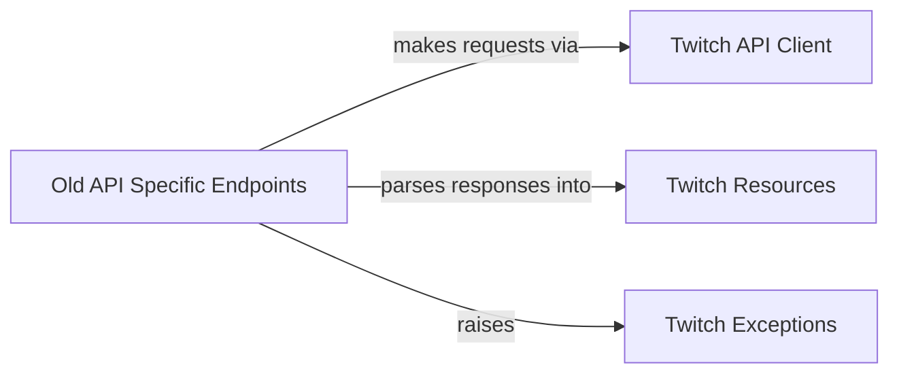

## Component Details

This architecture overview describes the subsystem responsible for interacting with the older Twitch API (v5). It details how various specific API endpoints for channels, streams, users, and communities are encapsulated, leveraging a core API client for HTTP requests, structured data models for responses, and custom exception handling for robust error management.

### Old API Specific Endpoints
Encapsulates the specific functionalities and methods for interacting with various categories of the older Twitch API (v5), such as channels, streams, users, and communities.

**Related Classes/Methods**:

- <a href="https://github.com/tsifrer/python-twitch-client/blob/master/twitch/api/collections.py#L8-L10" target="_blank" rel="noopener noreferrer">`python-twitch-client.twitch.api.collections.Collections:get_metadata` (8:10)</a>
- <a href="https://github.com/tsifrer/python-twitch-client/blob/master/twitch/api/collections.py#L12-L17" target="_blank" rel="noopener noreferrer">`python-twitch-client.twitch.api.collections.Collections:get` (12:17)</a>
- <a href="https://github.com/tsifrer/python-twitch-client/blob/master/twitch/api/collections.py#L19-L31" target="_blank" rel="noopener noreferrer">`python-twitch-client.twitch.api.collections.Collections:get_by_channel` (19:31)</a>
- <a href="https://github.com/tsifrer/python-twitch-client/blob/master/twitch/api/collections.py#L34-L41" target="_blank" rel="noopener noreferrer">`python-twitch-client.twitch.api.collections.Collections:create` (34:41)</a>
- <a href="https://github.com/tsifrer/python-twitch-client/blob/master/twitch/api/collections.py#L44-L48" target="_blank" rel="noopener noreferrer">`python-twitch-client.twitch.api.collections.Collections:update` (44:48)</a>
- <a href="https://github.com/tsifrer/python-twitch-client/blob/master/twitch/api/collections.py#L51-L55" target="_blank" rel="noopener noreferrer">`python-twitch-client.twitch.api.collections.Collections:create_thumbnail` (51:55)</a>
- <a href="https://github.com/tsifrer/python-twitch-client/blob/master/twitch/api/collections.py#L58-L59" target="_blank" rel="noopener noreferrer">`python-twitch-client.twitch.api.collections.Collections:delete` (58:59)</a>
- <a href="https://github.com/tsifrer/python-twitch-client/blob/master/twitch/api/collections.py#L62-L67" target="_blank" rel="noopener noreferrer">`python-twitch-client.twitch.api.collections.Collections:add_item` (62:67)</a>
- <a href="https://github.com/tsifrer/python-twitch-client/blob/master/twitch/api/collections.py#L70-L72" target="_blank" rel="noopener noreferrer">`python-twitch-client.twitch.api.collections.Collections:delete_item` (70:72)</a>
- <a href="https://github.com/tsifrer/python-twitch-client/blob/master/twitch/api/collections.py#L75-L78" target="_blank" rel="noopener noreferrer">`python-twitch-client.twitch.api.collections.Collections:move_item` (75:78)</a>
- <a href="https://github.com/tsifrer/python-twitch-client/blob/master/twitch/api/streams.py#L8-L83" target="_blank" rel="noopener noreferrer">`python-twitch-client.twitch.api.streams.Streams` (8:83)</a>
- <a href="https://github.com/tsifrer/python-twitch-client/blob/master/twitch/api/users.py#L14-L130" target="_blank" rel="noopener noreferrer">`python-twitch-client.twitch.api.users.Users` (14:130)</a>
- <a href="https://github.com/tsifrer/python-twitch-client/blob/master/twitch/api/chat.py#L4-L18" target="_blank" rel="noopener noreferrer">`python-twitch-client.twitch.api.chat.Chat` (4:18)</a>
- <a href="https://github.com/tsifrer/python-twitch-client/blob/master/twitch/api/communities.py#L7-L136" target="_blank" rel="noopener noreferrer">`python-twitch-client.twitch.api.communities.Communities` (7:136)</a>
- <a href="https://github.com/tsifrer/python-twitch-client/blob/master/twitch/api/channel_feed.py#L7-L105" target="_blank" rel="noopener noreferrer">`python-twitch-client.twitch.api.channel_feed.ChannelFeed` (7:105)</a>
- <a href="https://github.com/tsifrer/python-twitch-client/blob/master/twitch/api/teams.py#L6-L19" target="_blank" rel="noopener noreferrer">`python-twitch-client.twitch.api.teams.Teams` (6:19)</a>
- <a href="https://github.com/tsifrer/python-twitch-client/blob/master/twitch/api/videos.py#L14-L88" target="_blank" rel="noopener noreferrer">`python-twitch-client.twitch.api.videos.Videos` (14:88)</a>
- <a href="https://github.com/tsifrer/python-twitch-client/blob/master/twitch/api/games.py#L6-L15" target="_blank" rel="noopener noreferrer">`python-twitch-client.twitch.api.games.Games` (6:15)</a>
- <a href="https://github.com/tsifrer/python-twitch-client/blob/master/twitch/api/channels.py#L16-L156" target="_blank" rel="noopener noreferrer">`python-twitch-client.twitch.api.channels.Channels` (16:156)</a>
- <a href="https://github.com/tsifrer/python-twitch-client/blob/master/twitch/api/clips.py#L8-L56" target="_blank" rel="noopener noreferrer">`python-twitch-client.twitch.api.clips.Clips` (8:56)</a>
- <a href="https://github.com/tsifrer/python-twitch-client/blob/master/twitch/api/ingests.py#L5-L8" target="_blank" rel="noopener noreferrer">`python-twitch-client.twitch.api.ingests.Ingests` (5:8)</a>
- <a href="https://github.com/tsifrer/python-twitch-client/blob/master/twitch/api/search.py#L6-L33" target="_blank" rel="noopener noreferrer">`python-twitch-client.twitch.api.search.Search` (6:33)</a>

### Twitch API Client
This component is responsible for handling all HTTP requests to the Twitch API. It manages authentication headers, constructs URLs, and implements retry mechanisms for server-side errors to ensure robust communication with the Twitch service.

**Related Classes/Methods**:

- <a href="https://github.com/tsifrer/python-twitch-client/blob/master/twitch/api/base.py#L12-L95" target="_blank" rel="noopener noreferrer">`twitch.api.base.TwitchAPI` (12:95)</a>
- <a href="https://github.com/tsifrer/python-twitch-client/blob/master/twitch/api/base.py#L34-L57" target="_blank" rel="noopener noreferrer">`twitch.api.base.TwitchAPI._request_get` (34:57)</a>
- <a href="https://github.com/tsifrer/python-twitch-client/blob/master/twitch/api/base.py#L59-L70" target="_blank" rel="noopener noreferrer">`twitch.api.base.TwitchAPI._request_post` (59:70)</a>
- <a href="https://github.com/tsifrer/python-twitch-client/blob/master/twitch/api/base.py#L72-L82" target="_blank" rel="noopener noreferrer">`twitch.api.base.TwitchAPI._request_put` (72:82)</a>
- <a href="https://github.com/tsifrer/python-twitch-client/blob/master/twitch/api/base.py#L84-L95" target="_blank" rel="noopener noreferrer">`twitch.api.base.TwitchAPI._request_delete` (84:95)</a>
- <a href="https://github.com/tsifrer/python-twitch-client/blob/master/twitch/api/base.py#L22-L32" target="_blank" rel="noopener noreferrer">`twitch.api.base.TwitchAPI._get_request_headers` (22:32)</a>
- <a href="https://github.com/tsifrer/python-twitch-client/blob/master/twitch/api/base.py#L15-L20" target="_blank" rel="noopener noreferrer">`twitch.api.base.TwitchAPI:__init__` (15:20)</a>

### Twitch Resources
This component defines the data models for various Twitch API entities. It provides a base class and subclasses for parsing raw JSON responses into structured Python objects, facilitating easy access to API data and handling type conversions like timestamps.

**Related Classes/Methods**:

- <a href="https://github.com/tsifrer/python-twitch-client/blob/master/twitch/resources.py#L37-L65" target="_blank" rel="noopener noreferrer">`twitch.resources.TwitchObject` (37:65)</a>
- <a href="https://github.com/tsifrer/python-twitch-client/blob/master/twitch/resources.py#L58-L61" target="_blank" rel="noopener noreferrer">`twitch.resources.TwitchObject.construct_from` (58:61)</a>
- <a href="https://github.com/tsifrer/python-twitch-client/blob/master/twitch/resources.py#L63-L65" target="_blank" rel="noopener noreferrer">`twitch.resources.TwitchObject.refresh_from` (63:65)</a>
- <a href="https://github.com/tsifrer/python-twitch-client/blob/master/twitch/resources.py#L81-L82" target="_blank" rel="noopener noreferrer">`twitch.resources.Channel` (81:82)</a>
- <a href="https://github.com/tsifrer/python-twitch-client/blob/master/twitch/resources.py#L85-L86" target="_blank" rel="noopener noreferrer">`twitch.resources.Clip` (85:86)</a>
- <a href="https://github.com/tsifrer/python-twitch-client/blob/master/twitch/resources.py#L89-L90" target="_blank" rel="noopener noreferrer">`twitch.resources.Collection` (89:90)</a>
- <a href="https://github.com/tsifrer/python-twitch-client/blob/master/twitch/resources.py#L93-L94" target="_blank" rel="noopener noreferrer">`twitch.resources.Comment` (93:94)</a>
- <a href="https://github.com/tsifrer/python-twitch-client/blob/master/twitch/resources.py#L97-L98" target="_blank" rel="noopener noreferrer">`twitch.resources.Community` (97:98)</a>
- <a href="https://github.com/tsifrer/python-twitch-client/blob/master/twitch/resources.py#L101-L102" target="_blank" rel="noopener noreferrer">`twitch.resources.Featured` (101:102)</a>
- <a href="https://github.com/tsifrer/python-twitch-client/blob/master/twitch/resources.py#L105-L106" target="_blank" rel="noopener noreferrer">`twitch.resources.Follow` (105:106)</a>
- <a href="https://github.com/tsifrer/python-twitch-client/blob/master/twitch/resources.py#L109-L110" target="_blank" rel="noopener noreferrer">`twitch.resources.Game` (109:110)</a>
- <a href="https://github.com/tsifrer/python-twitch-client/blob/master/twitch/resources.py#L113-L114" target="_blank" rel="noopener noreferrer">`twitch.resources.Ingest` (113:114)</a>
- <a href="https://github.com/tsifrer/python-twitch-client/blob/master/twitch/resources.py#L117-L118" target="_blank" rel="noopener noreferrer">`twitch.resources.Item` (117:118)</a>
- <a href="https://github.com/tsifrer/python-twitch-client/blob/master/twitch/resources.py#L121-L122" target="_blank" rel="noopener noreferrer">`twitch.resources.Post` (121:122)</a>
- <a href="https://github.com/tsifrer/python-twitch-client/blob/master/twitch/resources.py#L125-L126" target="_blank" rel="noopener noreferrer">`twitch.resources.Stream` (125:126)</a>
- <a href="https://github.com/tsifrer/python-twitch-client/blob/master/twitch/resources.py#L129-L130" target="_blank" rel="noopener noreferrer">`twitch.resources.StreamMetadata` (129:130)</a>
- <a href="https://github.com/tsifrer/python-twitch-client/blob/master/twitch/resources.py#L133-L134" target="_blank" rel="noopener noreferrer">`twitch.resources.Subscription` (133:134)</a>
- <a href="https://github.com/tsifrer/python-twitch-client/blob/master/twitch/resources.py#L137-L138" target="_blank" rel="noopener noreferrer">`twitch.resources.Tag` (137:138)</a>
- <a href="https://github.com/tsifrer/python-twitch-client/blob/master/twitch/resources.py#L141-L142" target="_blank" rel="noopener noreferrer">`twitch.resources.Team` (141:142)</a>
- <a href="https://github.com/tsifrer/python-twitch-client/blob/master/twitch/resources.py#L145-L146" target="_blank" rel="noopener noreferrer">`twitch.resources.TopGame` (145:146)</a>
- <a href="https://github.com/tsifrer/python-twitch-client/blob/master/twitch/resources.py#L149-L150" target="_blank" rel="noopener noreferrer">`twitch.resources.User` (149:150)</a>
- <a href="https://github.com/tsifrer/python-twitch-client/blob/master/twitch/resources.py#L153-L154" target="_blank" rel="noopener noreferrer">`twitch.resources.UserBlock` (153:154)</a>
- <a href="https://github.com/tsifrer/python-twitch-client/blob/master/twitch/resources.py#L157-L158" target="_blank" rel="noopener noreferrer">`twitch.resources.Video` (157:158)</a>
- <a href="https://github.com/tsifrer/python-twitch-client/blob/master/twitch/resources.py#L68-L78" target="_blank" rel="noopener noreferrer">`twitch.resources._DateTime` (68:78)</a>
- <a href="https://github.com/tsifrer/python-twitch-client/blob/master/twitch/resources.py#L4-L34" target="_blank" rel="noopener noreferrer">`twitch.resources.convert_to_twitch_object` (4:34)</a>

### Twitch Exceptions
This component defines custom exception classes specifically for handling errors that may arise during interactions with the Twitch API. It provides a structured way to signal issues such as missing or invalid attributes in API requests or responses.

**Related Classes/Methods**:

- <a href="https://github.com/tsifrer/python-twitch-client/blob/master/twitch/exceptions.py#L9-L10" target="_blank" rel="noopener noreferrer">`twitch.exceptions.TwitchAttributeException` (9:10)</a>

### [FAQ](https://github.com/CodeBoarding/GeneratedOnBoardings/tree/main?tab=readme-ov-file#faq)