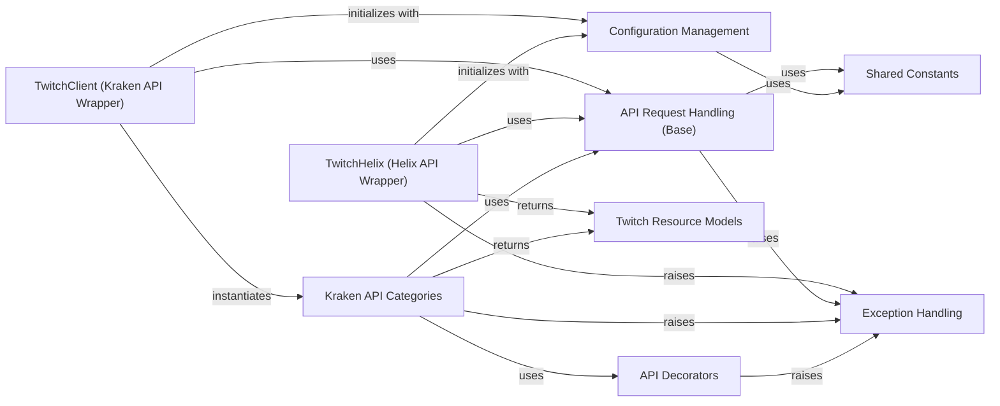

## Component Details

This graph describes the structure and interactions within the Twitch API Clients subsystem. It primarily focuses on how the system provides interfaces for both the older Twitch API (v5, Kraken) and the newer Twitch Helix API. The main flow involves client initialization, making API requests through dedicated handlers, processing responses into resource models, and managing authentication and error handling. The purpose is to offer a comprehensive and structured way to interact with various Twitch API functionalities.

### TwitchClient (Kraken API Wrapper)
Serves as the primary interface for interacting with the Twitch API v5 (Kraken), providing methods to access various Twitch resources by instantiating and managing specific API category classes. It also handles the initial loading of credentials.

**Related Classes/Methods**:

- <a href="https://github.com/tsifrer/python-twitch-client/blob/master/twitch/client.py#L24-L43" target="_blank" rel="noopener noreferrer">`python-twitch-client.twitch.client.TwitchClient:__init__` (24:43)</a>
- <a href="https://github.com/tsifrer/python-twitch-client/blob/master/twitch/client.py#L46-L51" target="_blank" rel="noopener noreferrer">`python-twitch-client.twitch.client.TwitchClient:channel_feed` (46:51)</a>
- <a href="https://github.com/tsifrer/python-twitch-client/blob/master/twitch/client.py#L54-L59" target="_blank" rel="noopener noreferrer">`python-twitch-client.twitch.client.TwitchClient:clips` (54:59)</a>
- <a href="https://github.com/tsifrer/python-twitch-client/blob/master/twitch/client.py#L62-L67" target="_blank" rel="noopener noreferrer">`python-twitch-client.twitch.client.TwitchClient:channels` (62:67)</a>
- <a href="https://github.com/tsifrer/python-twitch-client/blob/master/twitch/client.py#L70-L73" target="_blank" rel="noopener noreferrer">`python-twitch-client.twitch.client.TwitchClient:chat` (70:73)</a>
- <a href="https://github.com/tsifrer/python-twitch-client/blob/master/twitch/client.py#L76-L81" target="_blank" rel="noopener noreferrer">`python-twitch-client.twitch.client.TwitchClient:collections` (76:81)</a>
- <a href="https://github.com/tsifrer/python-twitch-client/blob/master/twitch/client.py#L84-L89" target="_blank" rel="noopener noreferrer">`python-twitch-client.twitch.client.TwitchClient:communities` (84:89)</a>
- <a href="https://github.com/tsifrer/python-twitch-client/blob/master/twitch/client.py#L92-L97" target="_blank" rel="noopener noreferrer">`python-twitch-client.twitch.client.TwitchClient:games` (92:97)</a>
- <a href="https://github.com/tsifrer/python-twitch-client/blob/master/twitch/client.py#L100-L105" target="_blank" rel="noopener noreferrer">`python-twitch-client.twitch.client.TwitchClient:ingests` (100:105)</a>
- <a href="https://github.com/tsifrer/python-twitch-client/blob/master/twitch/client.py#L108-L113" target="_blank" rel="noopener noreferrer">`python-twitch-client.twitch.client.TwitchClient:search` (108:113)</a>
- <a href="https://github.com/tsifrer/python-twitch-client/blob/master/twitch/client.py#L116-L121" target="_blank" rel="noopener noreferrer">`python-twitch-client.twitch.client.TwitchClient:streams` (116:121)</a>
- <a href="https://github.com/tsifrer/python-twitch-client/blob/master/twitch/client.py#L124-L129" target="_blank" rel="noopener noreferrer">`python-twitch-client.twitch.client.TwitchClient:teams` (124:129)</a>
- <a href="https://github.com/tsifrer/python-twitch-client/blob/master/twitch/client.py#L132-L137" target="_blank" rel="noopener noreferrer">`python-twitch-client.twitch.client.TwitchClient:users` (132:137)</a>
- <a href="https://github.com/tsifrer/python-twitch-client/blob/master/twitch/client.py#L140-L145" target="_blank" rel="noopener noreferrer">`python-twitch-client.twitch.client.TwitchClient:videos` (140:145)</a>

### TwitchHelix (Helix API Wrapper)
Provides the interface for interacting with the Twitch Helix API, including methods for retrieving various data types such as streams, games, clips, and users. It is responsible for handling OAuth authentication for Helix API calls.

**Related Classes/Methods**:

- <a href="https://github.com/tsifrer/python-twitch-client/blob/master/twitch/helix/api.py#L32-L41" target="_blank" rel="noopener noreferrer">`python-twitch-client.twitch.helix.api.TwitchHelix:__init__` (32:41)</a>
- <a href="https://github.com/tsifrer/python-twitch-client/blob/master/twitch/helix/api.py#L43-L70" target="_blank" rel="noopener noreferrer">`python-twitch-client.twitch.helix.api.TwitchHelix:get_oauth` (43:70)</a>
- <a href="https://github.com/tsifrer/python-twitch-client/blob/master/twitch/helix/api.py#L72-L118" target="_blank" rel="noopener noreferrer">`python-twitch-client.twitch.helix.api.TwitchHelix:get_streams` (72:118)</a>
- <a href="https://github.com/tsifrer/python-twitch-client/blob/master/twitch/helix/api.py#L120-L136" target="_blank" rel="noopener noreferrer">`python-twitch-client.twitch.helix.api.TwitchHelix:get_games` (120:136)</a>
- <a href="https://github.com/tsifrer/python-twitch-client/blob/master/twitch/helix/api.py#L138-L187" target="_blank" rel="noopener noreferrer">`python-twitch-client.twitch.helix.api.TwitchHelix:get_clips` (138:187)</a>
- <a href="https://github.com/tsifrer/python-twitch-client/blob/master/twitch/helix/api.py#L189-L205" target="_blank" rel="noopener noreferrer">`python-twitch-client.twitch.helix.api.TwitchHelix:get_top_games` (189:205)</a>
- <a href="https://github.com/tsifrer/python-twitch-client/blob/master/twitch/helix/api.py#L207-L271" target="_blank" rel="noopener noreferrer">`python-twitch-client.twitch.helix.api.TwitchHelix:get_videos` (207:271)</a>
- <a href="https://github.com/tsifrer/python-twitch-client/blob/master/twitch/helix/api.py#L273-L319" target="_blank" rel="noopener noreferrer">`python-twitch-client.twitch.helix.api.TwitchHelix:get_streams_metadata` (273:319)</a>
- <a href="https://github.com/tsifrer/python-twitch-client/blob/master/twitch/helix/api.py#L321-L340" target="_blank" rel="noopener noreferrer">`python-twitch-client.twitch.helix.api.TwitchHelix:get_user_follows` (321:340)</a>
- <a href="https://github.com/tsifrer/python-twitch-client/blob/master/twitch/helix/api.py#L342-L358" target="_blank" rel="noopener noreferrer">`python-twitch-client.twitch.helix.api.TwitchHelix:get_users` (342:358)</a>
- <a href="https://github.com/tsifrer/python-twitch-client/blob/master/twitch/helix/api.py#L360-L376" target="_blank" rel="noopener noreferrer">`python-twitch-client.twitch.helix.api.TwitchHelix:get_tags` (360:376)</a>

### API Request Handling (Base)
Encapsulates the core logic for making HTTP requests to the Twitch API for both Kraken and Helix versions. It manages rate limiting, constructs request headers, and handles the parsing of API responses. It includes classes for cursor-based pagination (APICursor) and single-fetch requests (APIGet) for Helix, and a base class for Kraken API interactions (TwitchAPI).

**Related Classes/Methods**:

- <a href="https://github.com/tsifrer/python-twitch-client/blob/master/twitch/helix/base.py#L79-L143" target="_blank" rel="noopener noreferrer">`python-twitch-client.twitch.helix.base.APICursor` (79:143)</a>
- <a href="https://github.com/tsifrer/python-twitch-client/blob/master/twitch/helix/base.py#L146-L157" target="_blank" rel="noopener noreferrer">`python-twitch-client.twitch.helix.base.APIGet` (146:157)</a>
- <a href="https://github.com/tsifrer/python-twitch-client/blob/master/twitch/api/base.py#L12-L95" target="_blank" rel="noopener noreferrer">`python-twitch-client.twitch.api.base.TwitchAPI` (12:95)</a>
- <a href="https://github.com/tsifrer/python-twitch-client/blob/master/twitch/helix/base.py#L14-L76" target="_blank" rel="noopener noreferrer">`python-twitch-client.twitch.helix.base.TwitchAPIMixin` (14:76)</a>

### Configuration Management
Responsible for reading and providing client credentials and other configuration settings, typically from a configuration file, to other parts of the system that require authentication or specific settings.

**Related Classes/Methods**:

- <a href="https://github.com/tsifrer/python-twitch-client/blob/master/twitch/conf.py#L13-L22" target="_blank" rel="noopener noreferrer">`python-twitch-client.twitch.conf.credentials_from_config_file` (13:22)</a>
- `python-twitch-client.twitch.conf` (full file reference)

### Kraken API Categories
A collection of classes, each dedicated to encapsulating specific functionalities and endpoints of the Twitch API v5 (Kraken). These classes provide methods for interacting with various Twitch resources such as channels, clips, chat, and user-related operations.

**Related Classes/Methods**:

- <a href="https://github.com/tsifrer/python-twitch-client/blob/master/twitch/api/channel_feed.py#L7-L105" target="_blank" rel="noopener noreferrer">`python-twitch-client.twitch.api.channel_feed.ChannelFeed` (7:105)</a>
- <a href="https://github.com/tsifrer/python-twitch-client/blob/master/twitch/api/clips.py#L8-L56" target="_blank" rel="noopener noreferrer">`python-twitch-client.twitch.api.clips.Clips` (8:56)</a>
- <a href="https://github.com/tsifrer/python-twitch-client/blob/master/twitch/api/channels.py#L16-L156" target="_blank" rel="noopener noreferrer">`python-twitch-client.twitch.api.channels.Channels` (16:156)</a>
- <a href="https://github.com/tsifrer/python-twitch-client/blob/master/twitch/api/chat.py#L4-L18" target="_blank" rel="noopener noreferrer">`python-twitch-client.twitch.api.chat.Chat` (4:18)</a>
- <a href="https://github.com/tsifrer/python-twitch-client/blob/master/twitch/api/collections.py#L7-L78" target="_blank" rel="noopener noreferrer">`python-twitch-client.twitch.api.collections.Collections` (7:78)</a>
- <a href="https://github.com/tsifrer/python-twitch-client/blob/master/twitch/api/communities.py#L7-L136" target="_blank" rel="noopener noreferrer">`python-twitch-client.twitch.api.communities.Communities` (7:136)</a>
- <a href="https://github.com/tsifrer/python-twitch-client/blob/master/twitch/api/games.py#L6-L15" target="_blank" rel="noopener noreferrer">`python-twitch-client.twitch.api.games.Games` (6:15)</a>
- <a href="https://github.com/tsifrer/python-twitch-client/blob/master/twitch/api/ingests.py#L5-L8" target="_blank" rel="noopener noreferrer">`python-twitch-client.twitch.api.ingests.Ingests` (5:8)</a>
- <a href="https://github.com/tsifrer/python-twitch-client/blob/master/twitch/api/search.py#L6-L33" target="_blank" rel="noopener noreferrer">`python-twitch-client.twitch.api.search.Search` (6:33)</a>
- <a href="https://github.com/tsifrer/python-twitch-client/blob/master/twitch/api/streams.py#L8-L83" target="_blank" rel="noopener noreferrer">`python-twitch-client.twitch.api.streams.Streams` (8:83)</a>
- <a href="https://github.com/tsifrer/python-twitch-client/blob/master/twitch/api/teams.py#L6-L19" target="_blank" rel="noopener noreferrer">`python-twitch-client.twitch.api.teams.Teams` (6:19)</a>
- <a href="https://github.com/tsifrer/python-twitch-client/blob/master/twitch/api/users.py#L14-L130" target="_blank" rel="noopener noreferrer">`python-twitch-client.twitch.api.users.Users` (14:130)</a>
- <a href="https://github.com/tsifrer/python-twitch-client/blob/master/twitch/api/videos.py#L14-L88" target="_blank" rel="noopener noreferrer">`python-twitch-client.twitch.api.videos.Videos` (14:88)</a>

### Exception Handling
Defines a set of custom exception classes used throughout the `python-twitch-client` library. These exceptions are raised to signal specific error conditions, such as issues related to OAuth authentication, invalid attribute values, or missing required data.

**Related Classes/Methods**:

- <a href="https://github.com/tsifrer/python-twitch-client/blob/master/twitch/exceptions.py#L17-L18" target="_blank" rel="noopener noreferrer">`python-twitch-client.twitch.exceptions.TwitchOAuthException` (17:18)</a>
- <a href="https://github.com/tsifrer/python-twitch-client/blob/master/twitch/exceptions.py#L9-L10" target="_blank" rel="noopener noreferrer">`python-twitch-client.twitch.exceptions.TwitchAttributeException` (9:10)</a>
- <a href="https://github.com/tsifrer/python-twitch-client/blob/master/twitch/exceptions.py#L5-L6" target="_blank" rel="noopener noreferrer">`python-twitch-client.twitch.exceptions.TwitchAuthException` (5:6)</a>
- <a href="https://github.com/tsifrer/python-twitch-client/blob/master/twitch/exceptions.py#L1-L2" target="_blank" rel="noopener noreferrer">`python-twitch-client.twitch.exceptions.TwitchException` (1:2)</a>
- <a href="https://github.com/tsifrer/python-twitch-client/blob/master/twitch/exceptions.py#L13-L14" target="_blank" rel="noopener noreferrer">`python-twitch-client.twitch.exceptions.TwitchNotProvidedException` (13:14)</a>

### Twitch Resource Models
Provides data models representing various Twitch entities (e.g., Channel, Clip, Stream, User). These models are used to structure the data returned by both Kraken and Helix API calls.

**Related Classes/Methods**:

- <a href="https://github.com/tsifrer/python-twitch-client/blob/master/twitch/resources.py#L37-L65" target="_blank" rel="noopener noreferrer">`python-twitch-client.twitch.resources.TwitchObject` (37:65)</a>
- <a href="https://github.com/tsifrer/python-twitch-client/blob/master/twitch/resources.py#L81-L82" target="_blank" rel="noopener noreferrer">`python-twitch-client.twitch.resources.Channel` (81:82)</a>
- <a href="https://github.com/tsifrer/python-twitch-client/blob/master/twitch/resources.py#L85-L86" target="_blank" rel="noopener noreferrer">`python-twitch-client.twitch.resources.Clip` (85:86)</a>
- <a href="https://github.com/tsifrer/python-twitch-client/blob/master/twitch/resources.py#L89-L90" target="_blank" rel="noopener noreferrer">`python-twitch-client.twitch.resources.Collection` (89:90)</a>
- <a href="https://github.com/tsifrer/python-twitch-client/blob/master/twitch/resources.py#L93-L94" target="_blank" rel="noopener noreferrer">`python-twitch-client.twitch.resources.Comment` (93:94)</a>
- <a href="https://github.com/tsifrer/python-twitch-client/blob/master/twitch/resources.py#L97-L98" target="_blank" rel="noopener noreferrer">`python-twitch-client.twitch.resources.Community` (97:98)</a>
- <a href="https://github.com/tsifrer/python-twitch-client/blob/master/twitch/resources.py#L101-L102" target="_blank" rel="noopener noreferrer">`python-twitch-client.twitch.resources.Featured` (101:102)</a>
- <a href="https://github.com/tsifrer/python-twitch-client/blob/master/twitch/resources.py#L105-L106" target="_blank" rel="noopener noreferrer">`python-twitch-client.twitch.resources.Follow` (105:106)</a>
- <a href="https://github.com/tsifrer/python-twitch-client/blob/master/twitch/resources.py#L109-L110" target="_blank" rel="noopener noreferrer">`python-twitch-client.twitch.resources.Game` (109:110)</a>
- <a href="https://github.com/tsifrer/python-twitch-client/blob/master/twitch/resources.py#L113-L114" target="_blank" rel="noopener noreferrer">`python-twitch-client.twitch.resources.Ingest` (113:114)</a>
- <a href="https://github.com/tsifrer/python-twitch-client/blob/master/twitch/resources.py#L117-L118" target="_blank" rel="noopener noreferrer">`python-twitch-client.twitch.resources.Item` (117:118)</a>
- <a href="https://github.com/tsifrer/python-twitch-client/blob/master/twitch/resources.py#L121-L122" target="_blank" rel="noopener noreferrer">`python-twitch-client.twitch.resources.Post` (121:122)</a>
- <a href="https://github.com/tsifrer/python-twitch-client/blob/master/twitch/resources.py#L125-L126" target="_blank" rel="noopener noreferrer">`python-twitch-client.twitch.resources.Stream` (125:126)</a>
- <a href="https://github.com/tsifrer/python-twitch-client/blob/master/twitch/resources.py#L129-L130" target="_blank" rel="noopener noreferrer">`python-twitch-client.twitch.resources.StreamMetadata` (129:130)</a>
- <a href="https://github.com/tsifrer/python-twitch-client/blob/master/twitch/resources.py#L133-L134" target="_blank" rel="noopener noreferrer">`python-twitch-client.twitch.resources.Subscription` (133:134)</a>
- <a href="https://github.com/tsifrer/python-twitch-client/blob/master/twitch/resources.py#L137-L138" target="_blank" rel="noopener noreferrer">`python-twitch-client.twitch.resources.Tag` (137:138)</a>
- <a href="https://github.com/tsifrer/python-twitch-client/blob/master/twitch/resources.py#L141-L142" target="_blank" rel="noopener noreferrer">`python-twitch-client.twitch.resources.Team` (141:142)</a>
- <a href="https://github.com/tsifrer/python-twitch-client/blob/master/twitch/resources.py#L145-L146" target="_blank" rel="noopener noreferrer">`python-twitch-client.twitch.resources.TopGame` (145:146)</a>
- <a href="https://github.com/tsifrer/python-twitch-client/blob/master/twitch/resources.py#L149-L150" target="_blank" rel="noopener noreferrer">`python-twitch-client.twitch.resources.User` (149:150)</a>
- <a href="https://github.com/tsifrer/python-twitch-client/blob/master/twitch/resources.py#L153-L154" target="_blank" rel="noopener noreferrer">`python-twitch-client.twitch.resources.UserBlock` (153:154)</a>
- <a href="https://github.com/tsifrer/python-twitch-client/blob/master/twitch/resources.py#L157-L158" target="_blank" rel="noopener noreferrer">`python-twitch-client.twitch.resources.Video` (157:158)</a>

### Shared Constants
Contains various constant values used across different parts of the Twitch API client, such as API endpoints, default values, and other fixed parameters.

**Related Classes/Methods**:

- `python-twitch-client.twitch.constants` (full file reference)

### API Decorators
Provides decorators used to modify the behavior of API methods, potentially for validation, error handling, or other cross-cutting concerns.

**Related Classes/Methods**:

- `python-twitch-client.twitch.decorators` (full file reference)

### [FAQ](https://github.com/CodeBoarding/GeneratedOnBoardings/tree/main?tab=readme-ov-file#faq)