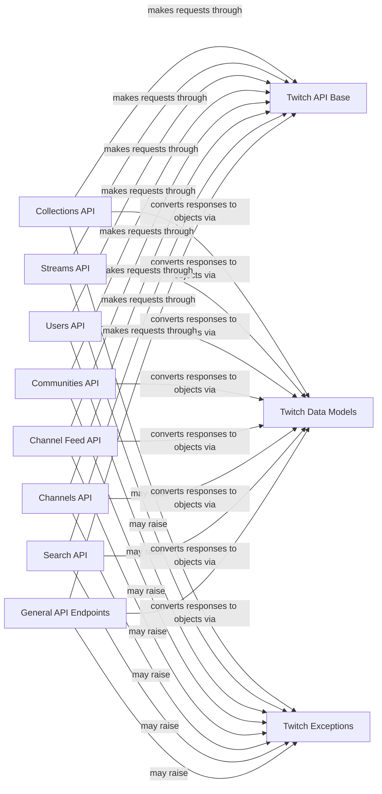

## Component Details

This architecture defines the structure and interactions of components within a Twitch API client. It encompasses data models for representing Twitch resources, a base for API communication, and specialized API components for various Twitch functionalities like streams, users, channels, and communities. The core flow involves API components making requests through the base API, receiving raw responses, and converting them into structured data models. Error handling is centralized through a dedicated exceptions component.

### Twitch Data Models
Defines the Python object structures for representing various Twitch API resources, facilitating the conversion of raw API responses into easily manipulable objects within the application. This component includes a base class for Twitch objects and specific classes for different Twitch entities like Channel, Clip, Stream, User, etc.

**Related Classes/Methods**:

- <a href="https://github.com/tsifrer/python-twitch-client/blob/master/twitch/resources.py#L4-L34" target="_blank" rel="noopener noreferrer">`python-twitch-client.twitch.resources:convert_to_twitch_object` (4:34)</a>
- <a href="https://github.com/tsifrer/python-twitch-client/blob/master/twitch/resources.py#L58-L61" target="_blank" rel="noopener noreferrer">`python-twitch-client.twitch.resources.TwitchObject:construct_from` (58:61)</a>
- <a href="https://github.com/tsifrer/python-twitch-client/blob/master/twitch/resources.py#L63-L65" target="_blank" rel="noopener noreferrer">`python-twitch-client.twitch.resources.TwitchObject:refresh_from` (63:65)</a>
- <a href="https://github.com/tsifrer/python-twitch-client/blob/master/twitch/resources.py#L53-L55" target="_blank" rel="noopener noreferrer">`python-twitch-client.twitch.resources.TwitchObject.__setitem__` (53:55)</a>
- <a href="https://github.com/tsifrer/python-twitch-client/blob/master/twitch/resources.py#L81-L82" target="_blank" rel="noopener noreferrer">`python-twitch-client.twitch.resources.Channel` (81:82)</a>
- <a href="https://github.com/tsifrer/python-twitch-client/blob/master/twitch/resources.py#L85-L86" target="_blank" rel="noopener noreferrer">`python-twitch-client.twitch.resources.Clip` (85:86)</a>
- <a href="https://github.com/tsifrer/python-twitch-client/blob/master/twitch/resources.py#L89-L90" target="_blank" rel="noopener noreferrer">`python-twitch-client.twitch.resources.Collection` (89:90)</a>
- <a href="https://github.com/tsifrer/python-twitch-client/blob/master/twitch/resources.py#L93-L94" target="_blank" rel="noopener noreferrer">`python-twitch-client.twitch.resources.Comment` (93:94)</a>
- <a href="https://github.com/tsifrer/python-twitch-client/blob/master/twitch/resources.py#L97-L98" target="_blank" rel="noopener noreferrer">`python-twitch-client.twitch.resources.Community` (97:98)</a>
- <a href="https://github.com/tsifrer/python-twitch-client/blob/master/twitch/resources.py#L101-L102" target="_blank" rel="noopener noreferrer">`python-twitch-client.twitch.resources.Featured` (101:102)</a>
- <a href="https://github.com/tsifrer/python-twitch-client/blob/master/twitch/resources.py#L105-L106" target="_blank" rel="noopener noreferrer">`python-twitch-client.twitch.resources.Follow` (105:106)</a>
- <a href="https://github.com/tsifrer/python-twitch-client/blob/master/twitch/resources.py#L109-L110" target="_blank" rel="noopener noreferrer">`python-twitch-client.twitch.resources.Game` (109:110)</a>
- <a href="https://github.com/tsifrer/python-twitch-client/blob/master/twitch/resources.py#L113-L114" target="_blank" rel="noopener noreferrer">`python-twitch-client.twitch.resources.Ingest` (113:114)</a>
- <a href="https://github.com/tsifrer/python-twitch-client/blob/master/twitch/resources.py#L117-L118" target="_blank" rel="noopener noreferrer">`python-twitch-client.twitch.resources.Item` (117:118)</a>
- <a href="https://github.com/tsifrer/python-twitch-client/blob/master/twitch/resources.py#L121-L122" target="_blank" rel="noopener noreferrer">`python-twitch-client.twitch.resources.Post` (121:122)</a>
- <a href="https://github.com/tsifrer/python-twitch-client/blob/master/twitch/resources.py#L125-L126" target="_blank" rel="noopener noreferrer">`python-twitch-client.twitch.resources.Stream` (125:126)</a>
- <a href="https://github.com/tsifrer/python-twitch-client/blob/master/twitch/resources.py#L129-L130" target="_blank" rel="noopener noreferrer">`python-twitch-client.twitch.resources.StreamMetadata` (129:130)</a>
- <a href="https://github.com/tsifrer/python-twitch-client/blob/master/twitch/resources.py#L133-L134" target="_blank" rel="noopener noreferrer">`python-twitch-client.twitch.resources.Subscription` (133:134)</a>
- <a href="https://github.com/tsifrer/python-twitch-client/blob/master/twitch/resources.py#L137-L138" target="_blank" rel="noopener noreferrer">`python-twitch-client.twitch.resources.Tag` (137:138)</a>
- <a href="https://github.com/tsifrer/python-twitch-client/blob/master/twitch/resources.py#L141-L142" target="_blank" rel="noopener noreferrer">`python-twitch-client.twitch.resources.Team` (141:142)</a>
- <a href="https://github.com/tsifrer/python-twitch-client/blob/master/twitch/resources.py#L145-L146" target="_blank" rel="noopener noreferrer">`python-twitch-client.twitch.resources.TopGame` (145:146)</a>
- <a href="https://github.com/tsifrer/python-twitch-client/blob/master/twitch/resources.py#L149-L150" target="_blank" rel="noopener noreferrer">`python-twitch-client.twitch.resources.User` (149:150)</a>
- <a href="https://github.com/tsifrer/python-twitch-client/blob/master/twitch/resources.py#L153-L154" target="_blank" rel="noopener noreferrer">`python-twitch-client.twitch.resources.UserBlock` (153:154)</a>
- <a href="https://github.com/tsifrer/python-twitch-client/blob/master/twitch/resources.py#L157-L158" target="_blank" rel="noopener noreferrer">`python-twitch-client.twitch.resources.Video` (157:158)</a>

### Twitch API Base
This component provides the fundamental methods for interacting with the Twitch API, including making GET, POST, PUT, and DELETE requests. It serves as the base for all specific API endpoint implementations, abstracting the underlying HTTP communication details.

**Related Classes/Methods**:

- <a href="https://github.com/tsifrer/python-twitch-client/blob/master/twitch/api/base.py#L34-L57" target="_blank" rel="noopener noreferrer">`python-twitch-client.twitch.api.base.TwitchAPI._request_get` (34:57)</a>
- <a href="https://github.com/tsifrer/python-twitch-client/blob/master/twitch/api/base.py#L59-L70" target="_blank" rel="noopener noreferrer">`python-twitch-client.twitch.api.base.TwitchAPI._request_post` (59:70)</a>
- <a href="https://github.com/tsifrer/python-twitch-client/blob/master/twitch/api/base.py#L72-L82" target="_blank" rel="noopener noreferrer">`python-twitch-client.twitch.api.base.TwitchAPI._request_put` (72:82)</a>
- <a href="https://github.com/tsifrer/python-twitch-client/blob/master/twitch/api/base.py#L84-L95" target="_blank" rel="noopener noreferrer">`python-twitch-client.twitch.api.base.TwitchAPI._request_delete` (84:95)</a>

### Collections API
This component provides methods for interacting with Twitch collections, allowing users to retrieve metadata, get collections, get collections by channel, create collections, and add items to collections. It acts as an interface for managing user-defined content groupings on Twitch.

**Related Classes/Methods**:

- <a href="https://github.com/tsifrer/python-twitch-client/blob/master/twitch/api/collections.py#L8-L10" target="_blank" rel="noopener noreferrer">`python-twitch-client.twitch.api.collections.Collections:get_metadata` (8:10)</a>
- <a href="https://github.com/tsifrer/python-twitch-client/blob/master/twitch/api/collections.py#L12-L17" target="_blank" rel="noopener noreferrer">`python-twitch-client.twitch.api.collections.Collections:get` (12:17)</a>
- <a href="https://github.com/tsifrer/python-twitch-client/blob/master/twitch/api/collections.py#L19-L31" target="_blank" rel="noopener noreferrer">`python-twitch-client.twitch.api.collections.Collections:get_by_channel` (19:31)</a>
- <a href="https://github.com/tsifrer/python-twitch-client/blob/master/twitch/api/collections.py#L34-L41" target="_blank" rel="noopener noreferrer">`python-twitch-client.twitch.api.collections.Collections:create` (34:41)</a>
- <a href="https://github.com/tsifrer/python-twitch-client/blob/master/twitch/api/collections.py#L62-L67" target="_blank" rel="noopener noreferrer">`python-twitch-client.twitch.api.collections.Collections:add_item` (62:67)</a>

### Streams API
This component handles interactions related to Twitch streams, including retrieving stream information by user, getting live streams, featured streams, followed streams, and streams within a community. It enables the client to access and manage real-time broadcast data.

**Related Classes/Methods**:

- <a href="https://github.com/tsifrer/python-twitch-client/blob/master/twitch/api/streams.py#L9-L22" target="_blank" rel="noopener noreferrer">`python-twitch-client.twitch.api.streams.Streams:get_stream_by_user` (9:22)</a>
- <a href="https://github.com/tsifrer/python-twitch-client/blob/master/twitch/api/streams.py#L24-L46" target="_blank" rel="noopener noreferrer">`python-twitch-client.twitch.api.streams.Streams:get_live_streams` (24:46)</a>
- <a href="https://github.com/tsifrer/python-twitch-client/blob/master/twitch/api/streams.py#L55-L63" target="_blank" rel="noopener noreferrer">`python-twitch-client.twitch.api.streams.Streams:get_featured` (55:63)</a>
- <a href="https://github.com/tsifrer/python-twitch-client/blob/master/twitch/api/streams.py#L66-L78" target="_blank" rel="noopener noreferrer">`python-twitch-client.twitch.api.streams.Streams:get_followed` (66:78)</a>
- <a href="https://github.com/tsifrer/python-twitch-client/blob/master/twitch/api/streams.py#L80-L83" target="_blank" rel="noopener noreferrer">`python-twitch-client.twitch.api.streams.Streams:get_streams_in_community` (80:83)</a>

### Users API
This component provides functionalities for managing and retrieving Twitch user information, such as getting user details, checking subscriptions, managing follows, and handling user blocks. It serves as the primary interface for user-centric operations.

**Related Classes/Methods**:

- <a href="https://github.com/tsifrer/python-twitch-client/blob/master/twitch/api/users.py#L16-L18" target="_blank" rel="noopener noreferrer">`python-twitch-client.twitch.api.users.Users:get` (16:18)</a>
- <a href="https://github.com/tsifrer/python-twitch-client/blob/master/twitch/api/users.py#L20-L22" target="_blank" rel="noopener noreferrer">`python-twitch-client.twitch.api.users.Users:get_by_id` (20:22)</a>
- <a href="https://github.com/tsifrer/python-twitch-client/blob/master/twitch/api/users.py#L30-L34" target="_blank" rel="noopener noreferrer">`python-twitch-client.twitch.api.users.Users:check_subscribed_to_channel` (30:34)</a>
- <a href="https://github.com/tsifrer/python-twitch-client/blob/master/twitch/api/users.py#L36-L57" target="_blank" rel="noopener noreferrer">`python-twitch-client.twitch.api.users.Users:get_all_follows` (36:57)</a>
- <a href="https://github.com/tsifrer/python-twitch-client/blob/master/twitch/api/users.py#L59-L83" target="_blank" rel="noopener noreferrer">`python-twitch-client.twitch.api.users.Users:get_follows` (59:83)</a>
- <a href="https://github.com/tsifrer/python-twitch-client/blob/master/twitch/api/users.py#L85-L89" target="_blank" rel="noopener noreferrer">`python-twitch-client.twitch.api.users.Users:check_follows_channel` (85:89)</a>
- <a href="https://github.com/tsifrer/python-twitch-client/blob/master/twitch/api/users.py#L92-L97" target="_blank" rel="noopener noreferrer">`python-twitch-client.twitch.api.users.Users:follow_channel` (92:97)</a>
- <a href="https://github.com/tsifrer/python-twitch-client/blob/master/twitch/api/users.py#L104-L112" target="_blank" rel="noopener noreferrer">`python-twitch-client.twitch.api.users.Users:get_user_block_list` (104:112)</a>
- <a href="https://github.com/tsifrer/python-twitch-client/blob/master/twitch/api/users.py#L115-L119" target="_blank" rel="noopener noreferrer">`python-twitch-client.twitch.api.users.Users:block_user` (115:119)</a>
- <a href="https://github.com/tsifrer/python-twitch-client/blob/master/twitch/api/users.py#L125-L130" target="_blank" rel="noopener noreferrer">`python-twitch-client.twitch.api.users.Users:translate_usernames_to_ids` (125:130)</a>

### Communities API
This component allows interaction with Twitch communities, enabling retrieval of community details by name or ID, getting top communities, and managing banned or timed-out users and moderators within a community. It facilitates the management and exploration of Twitch's community features.

**Related Classes/Methods**:

- <a href="https://github.com/tsifrer/python-twitch-client/blob/master/twitch/api/communities.py#L8-L11" target="_blank" rel="noopener noreferrer">`python-twitch-client.twitch.api.communities.Communities:get_by_name` (8:11)</a>
- <a href="https://github.com/tsifrer/python-twitch-client/blob/master/twitch/api/communities.py#L13-L15" target="_blank" rel="noopener noreferrer">`python-twitch-client.twitch.api.communities.Communities:get_by_id` (13:15)</a>
- <a href="https://github.com/tsifrer/python-twitch-client/blob/master/twitch/api/communities.py#L28-L35" target="_blank" rel="noopener noreferrer">`python-twitch-client.twitch.api.communities.Communities:get_top` (28:35)</a>
- <a href="https://github.com/tsifrer/python-twitch-client/blob/master/twitch/api/communities.py#L38-L48" target="_blank" rel="noopener noreferrer">`python-twitch-client.twitch.api.communities.Communities:get_banned_users` (38:48)</a>
- <a href="https://github.com/tsifrer/python-twitch-client/blob/master/twitch/api/communities.py#L84-L86" target="_blank" rel="noopener noreferrer">`python-twitch-client.twitch.api.communities.Communities:get_moderators` (84:86)</a>
- <a href="https://github.com/tsifrer/python-twitch-client/blob/master/twitch/api/communities.py#L113-L122" target="_blank" rel="noopener noreferrer">`python-twitch-client.twitch.api.communities.Communities:get_timed_out_users` (113:122)</a>

### Channel Feed API
This component manages operations related to Twitch channel feeds, including getting posts and comments, creating and deleting posts, and creating and deleting comments. It provides the means to interact with the social feed functionality of Twitch channels.

**Related Classes/Methods**:

- <a href="https://github.com/tsifrer/python-twitch-client/blob/master/twitch/api/channel_feed.py#L8-L20" target="_blank" rel="noopener noreferrer">`python-twitch-client.twitch.api.channel_feed.ChannelFeed:get_posts` (8:20)</a>
- <a href="https://github.com/tsifrer/python-twitch-client/blob/master/twitch/api/channel_feed.py#L22-L32" target="_blank" rel="noopener noreferrer">`python-twitch-client.twitch.api.channel_feed.ChannelFeed:get_post` (22:32)</a>
- <a href="https://github.com/tsifrer/python-twitch-client/blob/master/twitch/api/channel_feed.py#L35-L41" target="_blank" rel="noopener noreferrer">`python-twitch-client.twitch.api.channel_feed.ChannelFeed:create_post` (35:41)</a>
- <a href="https://github.com/tsifrer/python-twitch-client/blob/master/twitch/api/channel_feed.py#L44-L46" target="_blank" rel="noopener noreferrer">`python-twitch-client.twitch.api.channel_feed.ChannelFeed:delete_post` (44:46)</a>
- <a href="https://github.com/tsifrer/python-twitch-client/blob/master/twitch/api/channel_feed.py#L62-L74" target="_blank" rel="noopener noreferrer">`python-twitch-client.twitch.api.channel_feed.ChannelFeed:get_post_comments` (62:74)</a>
- <a href="https://github.com/tsifrer/python-twitch-client/blob/master/twitch/api/channel_feed.py#L77-L81" target="_blank" rel="noopener noreferrer">`python-twitch-client.twitch.api.channel_feed.ChannelFeed:create_post_comment` (77:81)</a>
- <a href="https://github.com/tsifrer/python-twitch-client/blob/master/twitch/api/channel_feed.py#L84-L87" target="_blank" rel="noopener noreferrer">`python-twitch-client.twitch.api.channel_feed.ChannelFeed:delete_post_comment` (84:87)</a>

### Channels API
This component provides methods for interacting with Twitch channels, such as retrieving channel details, updating channel information, getting editors, followers, teams, and subscribers, checking subscriptions, getting videos, resetting stream keys, and getting community information. It offers comprehensive control over Twitch channel properties and associated data.

**Related Classes/Methods**:

- <a href="https://github.com/tsifrer/python-twitch-client/blob/master/twitch/api/channels.py#L18-L20" target="_blank" rel="noopener noreferrer">`python-twitch-client.twitch.api.channels.Channels:get` (18:20)</a>
- <a href="https://github.com/tsifrer/python-twitch-client/blob/master/twitch/api/channels.py#L22-L24" target="_blank" rel="noopener noreferrer">`python-twitch-client.twitch.api.channels.Channels:get_by_id` (22:24)</a>
- <a href="https://github.com/tsifrer/python-twitch-client/blob/master/twitch/api/channels.py#L27-L42" target="_blank" rel="noopener noreferrer">`python-twitch-client.twitch.api.channels.Channels:update` (27:42)</a>
- <a href="https://github.com/tsifrer/python-twitch-client/blob/master/twitch/api/channels.py#L45-L47" target="_blank" rel="noopener noreferrer">`python-twitch-client.twitch.api.channels.Channels:get_editors` (45:47)</a>
- <a href="https://github.com/tsifrer/python-twitch-client/blob/master/twitch/api/channels.py#L49-L67" target="_blank" rel="noopener noreferrer">`python-twitch-client.twitch.api.channels.Channels:get_followers` (49:67)</a>
- <a href="https://github.com/tsifrer/python-twitch-client/blob/master/twitch/api/channels.py#L69-L71" target="_blank" rel="noopener noreferrer">`python-twitch-client.twitch.api.channels.Channels:get_teams` (69:71)</a>
- <a href="https://github.com/tsifrer/python-twitch-client/blob/master/twitch/api/channels.py#L74-L88" target="_blank" rel="noopener noreferrer">`python-twitch-client.twitch.api.channels.Channels:get_subscribers` (74:88)</a>
- <a href="https://github.com/tsifrer/python-twitch-client/blob/master/twitch/api/channels.py#L90-L94" target="_blank" rel="noopener noreferrer">`python-twitch-client.twitch.api.channels.Channels:check_subscription_by_user` (90:94)</a>
- <a href="https://github.com/tsifrer/python-twitch-client/blob/master/twitch/api/channels.py#L96-L133" target="_blank" rel="noopener noreferrer">`python-twitch-client.twitch.api.channels.Channels:get_videos` (96:133)</a>
- <a href="https://github.com/tsifrer/python-twitch-client/blob/master/twitch/api/channels.py#L144-L146" target="_blank" rel="noopener noreferrer">`python-twitch-client.twitch.api.channels.Channels:reset_stream_key` (144:146)</a>
- <a href="https://github.com/tsifrer/python-twitch-client/blob/master/twitch/api/channels.py#L148-L150" target="_blank" rel="noopener noreferrer">`python-twitch-client.twitch.api.channels.Channels:get_community` (148:150)</a>

### Search API
This component offers functionalities for searching Twitch content, including channels, games, and streams. It enables users to discover various types of content available on the Twitch platform.

**Related Classes/Methods**:

- <a href="https://github.com/tsifrer/python-twitch-client/blob/master/twitch/api/search.py#L7-L15" target="_blank" rel="noopener noreferrer">`python-twitch-client.twitch.api.search.Search:channels` (7:15)</a>
- <a href="https://github.com/tsifrer/python-twitch-client/blob/master/twitch/api/search.py#L17-L23" target="_blank" rel="noopener noreferrer">`python-twitch-client.twitch.api.search.Search:games` (17:23)</a>
- <a href="https://github.com/tsifrer/python-twitch-client/blob/master/twitch/api/search.py#L25-L33" target="_blank" rel="noopener noreferrer">`python-twitch-client.twitch.api.search.Search:streams` (25:33)</a>

### General API Endpoints
This component groups various Twitch API endpoints that provide functionalities for teams, videos, games, clips, and ingests. It serves as a consolidated interface for less frequently accessed or specialized API interactions.

**Related Classes/Methods**:

- <a href="https://github.com/tsifrer/python-twitch-client/blob/master/twitch/api/teams.py#L7-L9" target="_blank" rel="noopener noreferrer">`python-twitch-client.twitch.api.teams.Teams:get` (7:9)</a>
- <a href="https://github.com/tsifrer/python-twitch-client/blob/master/twitch/api/teams.py#L11-L19" target="_blank" rel="noopener noreferrer">`python-twitch-client.twitch.api.teams.Teams:get_all` (11:19)</a>
- <a href="https://github.com/tsifrer/python-twitch-client/blob/master/twitch/api/videos.py#L15-L17" target="_blank" rel="noopener noreferrer">`python-twitch-client.twitch.api.videos.Videos:get_by_id` (15:17)</a>
- <a href="https://github.com/tsifrer/python-twitch-client/blob/master/twitch/api/videos.py#L19-L52" target="_blank" rel="noopener noreferrer">`python-twitch-client.twitch.api.videos.Videos:get_top` (19:52)</a>
- <a href="https://github.com/tsifrer/python-twitch-client/blob/master/twitch/api/videos.py#L55-L73" target="_blank" rel="noopener noreferrer">`python-twitch-client.twitch.api.videos.Videos:get_followed_videos` (55:73)</a>
- <a href="https://github.com/tsifrer/python-twitch-client/blob/master/twitch/api/games.py#L7-L15" target="_blank" rel="noopener noreferrer">`python-twitch-client.twitch.api.games.Games:get_top` (7:15)</a>
- <a href="https://github.com/tsifrer/python-twitch-client/blob/master/twitch/api/clips.py#L9-L11" target="_blank" rel="noopener noreferrer">`python-twitch-client.twitch.api.clips.Clips:get_by_slug` (9:11)</a>
- <a href="https://github.com/tsifrer/python-twitch-client/blob/master/twitch/api/clips.py#L13-L44" target="_blank" rel="noopener noreferrer">`python-twitch-client.twitch.api.clips.Clips:get_top` (13:44)</a>
- <a href="https://github.com/tsifrer/python-twitch-client/blob/master/twitch/api/clips.py#L47-L56" target="_blank" rel="noopener noreferrer">`python-twitch-client.twitch.api.clips.Clips:followed` (47:56)</a>
- <a href="https://github.com/tsifrer/python-twitch-client/blob/master/twitch/api/ingests.py#L6-L8" target="_blank" rel="noopener noreferrer">`python-twitch-client.twitch.api.ingests.Ingests:get_server_list` (6:8)</a>

### Twitch Exceptions
This component defines and handles exceptions specific to the Twitch API interactions, ensuring robust error management within the client. It provides a structured way to signal and manage errors encountered during API calls.

**Related Classes/Methods**:

- <a href="https://github.com/tsifrer/python-twitch-client/blob/master/twitch/exceptions.py#L9-L10" target="_blank" rel="noopener noreferrer">`python-twitch-client.twitch.exceptions.TwitchAttributeException` (9:10)</a>

### [FAQ](https://github.com/CodeBoarding/GeneratedOnBoardings/tree/main?tab=readme-ov-file#faq)